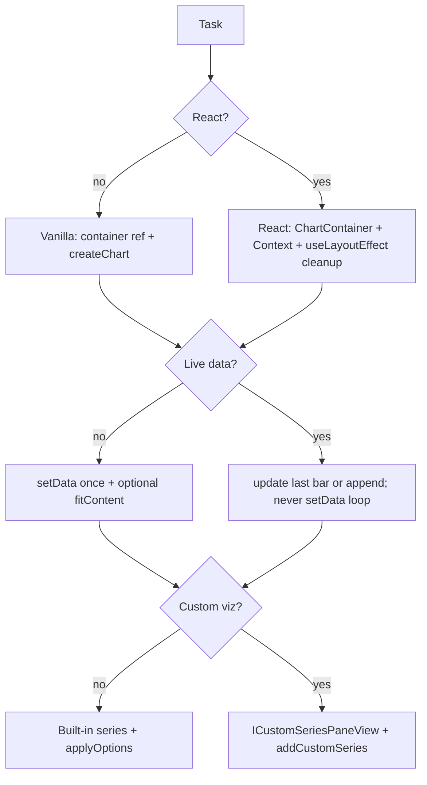

# Lightweight Charts Agent Skill — Design Spec

**Date:** 2026-05-21  
**Status:** Approved (brainstorming)  
**Target:** `skills/lightweight-charts/` in this repository

## Summary

Create a **Tier 2 hybrid** agent skill for [TradingView Lightweight Charts](https://tradingview.github.io/lightweight-charts/docs) **v5.x** (pinned to v5.2 docs). The skill guides browser-side chart implementation in **vanilla JS/TS** and **React** (official integration pattern), covering core charts, realtime updates, and custom series plugins. Curated `references/` files cover high-friction topics only; full API detail remains on official docs.

## Goals

1. **Discoverability:** Agents load the skill when users mention `lightweight-charts`, candlestick charts, `setData`/`update`, React chart integration, or custom series plugins.
2. **Correctness:** Encode v5 API patterns and common failure modes (lifecycle, time formats, realtime, resize, attribution).
3. **Efficiency:** Keep `SKILL.md` under ~300 lines; load `references/` only when needed.

## Non-Goals (v1)

- v3/v4 migration content (v5-only skill).
- Server-side / Node chart rendering (library is client-only per official requirements).
- Full offline mirror of the API reference or all tutorials.
- Trading strategies, market data feeds, or backtesting logic.
- Default recommendation of third-party React wrappers (document as optional only).

## Approach Selected

**Curated friction docs (Hybrid C)** — among three options considered:

| Approach | Verdict |
|----------|---------|
| Curated friction docs | **Selected** — balance of offline gotchas + small footprint |
| Broad doc mirror | Rejected — maintenance burden, token bloat |
| Link-only technique | Rejected — agents repeat same mistakes |

## Requirements (from brainstorming)

| Decision | Choice |
|----------|--------|
| Skill shape | Hybrid: slim dispatcher + selective `references/` |
| Integration | Vanilla + React (decision tree in `SKILL.md`) |
| Feature depth | Core + realtime + plugins |
| Version | v5.x only (no v4 migration section) |

## Directory Structure

```
skills/lightweight-charts/
├── SKILL.md                      # Dispatcher: triggers, decision tree, workflow, index
├── gotchas.md                    # Anti-rationalization rules agents must not skip
└── references/
    ├── readme.md                 # Topic index + official doc links (v5.2)
    ├── core/
    │   ├── chart-and-series.md   # createChart, addSeries, built-in series types
    │   ├── data-and-time.md      # time formats, ascending data, setData vs update
    │   └── lifecycle-resize.md # chart.remove, ResizeObserver, fitContent, autoscale
    ├── react/
    │   └── integration.md        # official refs/context/useLayoutEffect pattern
    ├── realtime/
    │   └── streaming.md          # update last bar vs new bar; avoid setData loops
    └── plugins/
        └── custom-series.md      # ICustomSeriesPaneView, addCustomSeries skeleton
```

## SKILL.md Content

### Frontmatter (CSO)

```yaml
---
name: lightweight-charts
description: >-
  Use when building or debugging TradingView Lightweight Charts v5 in the
  browser: createChart, candlestick/line series, setData vs update, realtime
  ticks, resize/cleanup, React integration, custom series plugins, or
  time-scale issues.
metadata:
  category: reference
  triggers:
    - lightweight-charts
    - createChart
    - addSeries
    - CandlestickSeries
    - setData
    - series.update
    - chart.remove
    - ICustomSeriesPaneView
    - addCustomSeries
    - fitContent
    - time scale
    - TradingView chart
---
```

### Body sections

1. **When to use** — chart UI in browser; debugging blank chart, wrong time axis, live tick performance.
2. **When NOT to use** — SSR-only rendering, v4 API (`addCandlestickSeries` etc.), non-chart charting libs.
3. **Decision tree**
   - React? → `references/react/integration.md` vs vanilla `references/core/`
   - Live data? → `references/realtime/streaming.md`
   - Custom visualization? → `references/plugins/custom-series.md`
4. **Agent workflow** (ordered steps)
   1. Confirm v5 dependency and client-only environment.
   2. Ensure container has non-zero dimensions.
   3. `createChart(container, options)` → `chart.addSeries(SeriesType, options)`.
   4. Initial load: `series.setData(sortedData)` → `chart.timeScale().fitContent()` if appropriate.
   5. Live updates: `series.update(bar)` only (never `setData` per tick).
   6. Resize: `ResizeObserver` or window listener → `chart.applyOptions({ width })`.
   7. Teardown: `chart.remove()` on unmount/route leave.
   8. Public app: add TradingView attribution per license.
5. **Quick reference table** — topic → local `references/` path.
6. **Common mistakes** — pointer to `gotchas.md`.
7. **Official links** — version-pinned base: `https://tradingview.github.io/lightweight-charts/docs`

### React integration policy

- **Default:** Official tutorials — [simple](https://tradingview.github.io/lightweight-charts/tutorials/react/simple), [advanced](https://tradingview.github.io/lightweight-charts/tutorials/react/advanced) (refs, Context, `useLayoutEffect`, `isRemoved` guard for Strict Mode).
- **Optional:** Community `lightweight-charts-react-wrapper` — mention in `references/react/integration.md` as alternative, not the primary path.

## Reference File Content (curated excerpts)

Each reference file should:

- Start with **when to read this file**.
- Include **minimal working snippets** (v5 imports: `createChart`, `AreaSeries`, `CandlestickSeries`, etc.).
- Link to the canonical official page for full option lists.
- Avoid duplicating entire API tables.

### `references/core/chart-and-series.md`

- `createChart`, `IChartApi`, `chart.addSeries(AreaSeries | BarSeries | …)`.
- Series types: Area, Bar, Baseline, Candlestick, Histogram, Line.
- `applyOptions` on chart and series.
- Note: series type cannot be changed in place; remove and re-add.

### `references/core/data-and-time.md`

- `UTCTimestamp` (number) vs business day (`'2018-12-22'` string).
- Data must be **ascending by time**.
- `setData` replaces all points (initial load or full refresh).
- `update` for last bar revision or new bar (realtime).
- Performance warning from docs: avoid `setData` for streaming.

### `references/core/lifecycle-resize.md`

- `chart.remove()` required on teardown.
- Container sizing (explicit height; width from layout or parent).
- `chart.timeScale().fitContent()` and logical range margin trick when needed.
- `ResizeObserver` pattern for responsive width.

### `references/react/integration.md`

- Simple: single `useRef` + `useEffect` with cleanup `remove()`.
- Advanced: `ChartContainer` / `Series` with Context + `useImperativeHandle` + `useLayoutEffect`.
- Effect ordering pitfall (child before parent) and ref-based fix.
- Next.js / RSC: client component boundary only; no `createChart` in server components.

### `references/realtime/streaming.md`

- Update same `time` key to revise last candle; new `time` to append.
- Debouncing / throttling guidance (application-level, not library).
- Optional: syncing multiple charts via time scale / crosshair (recipe + official links).

### `references/plugins/custom-series.md`

- `ICustomSeriesPaneView` implementation outline.
- `chart.addCustomSeries(customPaneView, options)`.
- Link: [Plugins intro](https://tradingview.github.io/lightweight-charts/docs/plugins/intro).

### `gotchas.md` (hard rules)

| Rule | Rationale |
|------|-----------|
| Do not call `setData` on every tick | Official perf guidance; use `update` |
| Always `chart.remove()` on unmount | Prevent leaks and ghost listeners |
| Container must have explicit size | Zero height → invisible chart |
| Time values must be ascending | Library assertion / broken scale |
| Do not instantiate chart in Node/SSR | Client-only library |
| Include TradingView attribution on public UIs | License requirement (NOTICE + link) |
| React Strict Mode: guard with `isRemoved` | Double mount cleanup order (official advanced example) |

## Agent Workflow Diagram



## Testing Plan (writing-skills RED-GREEN)

Manual pressure scenarios before considering the skill complete:

| # | User prompt | Pass criteria |
|---|-------------|---------------|
| 1 | React candlestick + live price | Uses `update`, `chart.remove()` on unmount, loads skill |
| 2 | Chart is blank | Diagnoses container height/width |
| 3 | Upgrade from lightweight-charts v4 | States v5-only skill; points to external migration doc, does not invent v4 API |
| 4 | Custom heatmap series | Opens `references/plugins/custom-series.md` |
| 5 | Next.js App Router chart page | Client component only; no SSR `createChart` |

Record outcomes in implementation PR or a short note in the skill PR description (no separate `testing-scenarios.md` in v1 unless needed).

## Implementation Checklist (for writing-plans)

- [ ] Create `skills/lightweight-charts/` per structure above
- [ ] Author `SKILL.md` following `writing-skills` standards (name = directory, description = triggers)
- [ ] Author `gotchas.md` with anti-rationalization language ("Do NOT … because …")
- [ ] Author seven reference files with snippets + official links
- [ ] Run five pressure scenarios; fix skill text if agent fails
- [ ] Verify `SKILL.md` line count < 500; total skill reasonable for Tier 2

## Dependencies & Constraints

- **npm package:** `lightweight-charts` (v5.x; align examples with 5.2 docs).
- **Browser:** ES2020+; transpile in build if targeting older browsers.
- **License:** TradingView attribution on public pages ([getting started — license](https://tradingview.github.io/lightweight-charts/docs)).

## Related Skills

- `writing-skills` — structure, CSO, testing discipline
- `frontend-design` — visual polish around chart containers (not chart API)
- `webapp-testing` — Playwright verification of chart pages if needed

## Open Questions

None for v1. Future optional additions (not in scope now):

- Mirrored upgrade guide if team still on v4
- `references/testing-scenarios.md` if manual table in this spec is insufficient
- Vue/Svelte framework notes if demand appears
